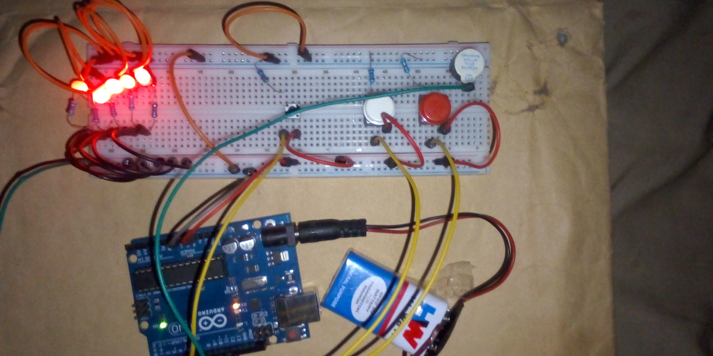

# Button-Controlled LED Brightness System – Arduino Project

## Overview
This project demonstrates a button-controlled LED brightness system using Arduino. A switch button is used to toggle the LED ON and OFF, while two additional buttons allow the user to increase or decrease the LED brightness. A buzzer provides audio feedback when brightness limits are reached.

## Objective
- Learn to read multiple push button inputs using Arduino
- Implement LED ON/OFF toggling using state tracking
- Control LED brightness using PWM (`analogWrite`)
- Use a buzzer for audio feedback
- Monitor system behavior using the Serial Monitor

## Components Used
- Arduino Uno
- LED
- Push buttons × 3 (ON/OFF, Increase, Decrease)
- Buzzer
- 220Ω resistors
- Breadboard
- Jumper wires
- 9V Battery
- 9V Battery Clip to DC Barrel Jack

## Circuit Diagram

For other images [Click Here](images/)

## How It Works
1. The ON/OFF button toggles the LED state using edge detection logic.
2. When the LED is ON:
   - Pressing the increase button raises the LED brightness in steps of 25.
   - Pressing the decrease button lowers the LED brightness in steps of 25.
3. PWM (`analogWrite`) is used to control LED brightness.
4. The buzzer activates when:
   - Maximum brightness is reached
   - Minimum brightness is reached
   - An invalid brightness operation is attempted
5. The Serial Monitor displays real-time button states and LED status for debugging.

## Code
The Arduino sketch for this project is located in the [code/ directory](code/button_brightness_controlled_project_on_11th_november_2025.ino).

## Demo Video
A demonstration video showing the working project is included in this repository.

📹 **Project Demonstration:**  
[Click here to watch/download the demo video](video/)

*(If the video does not preview directly on GitHub, please download it using the link above.)*

## Reflection (What I Learned)
- How to manage button states and toggle logic
- Using PWM to control LED brightness
- Implementing limits and safeguards in embedded systems
- Integrating visual and audio feedback in Arduino projects

## Challenges Faced
- Managing button state transitions reliably
- Preventing brightness overflow and underflow
- Coordinating buzzer alerts with LED behavior

## Possible Improvements
- Add button debouncing for smoother input detection
- Display brightness level using LEDs or an LCD
- Replace delay-based logic with non-blocking timing

## Project Status
Completed
